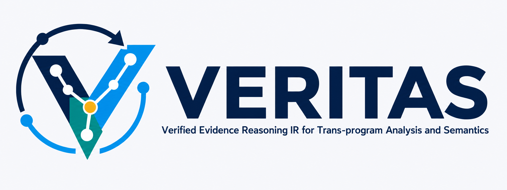

<p align="center">
  
</p>

# VERITAS

**Verified Evidence Reasoning IR for Trans-program Analysis and Semantics**

---

## Overview

VERITAS is an evidence-centric whole-program analysis platform that combines deterministic static analysis with LLM-assisted semantic reasoning.

**Core Thesis:** A Review Agent should never be asked to "understand a million-line repository." Deterministic analysis first builds a compact, immutable, provenance-carrying semantic world. The Agent reasons only over that structured representation (Evidence IR), and any hypothesis it produces must round-trip through a deterministic verifier before becoming a fact.

**Three IRs:**

1. **Function Summary IR** — externally visible semantic effects of a function (calls, memory reads/writes, value flows, ranges, aliases, locks, state transitions, unknowns). Immutable, content-addressed, component-hashed.

2. **SummaryDB** — a logical subsystem across seven physical layers: Object Store · Metadata · Fact Store · Graph Index · Dependency Index · Evidence Cache · History Store.

3. **Evidence IR (EIR)** — claim-oriented, provenance-preserving typed graph IR the Agent consumes. Enforces MUST / MAY / MUST_NOT / INFERRED / ASSUMED / UNKNOWN as distinct epistemic states.

**Pipeline:** Ingest (compile_commands.json, bitcode, or external analysis) → module acquisition → local static analysis → Function Summary IR → SummaryDB → Incremental WPA (SCC + fixpoint + Datalog) → global derived facts → Evidence Builder → Evidence IR → Agent + Proof Engines → Review Result.

---

## Key Features

- **Immutable summaries** — every function summary is content-addressed; changes create new versions
- **Semantic incrementality** — invalidation based on component deltas (not file timestamps)
- **Full provenance** — every derived fact traces back to source anchors and analysis rules
- **Explicit uncertainty** — MUST / MAY / INFERRED / ASSUMED / UNKNOWN states preserved throughout
- **Whole-program analysis** — SCC-aware fixpoint computation over call graphs and value flows
- **Pluggable backends** — storage adapters for RocksDB, SQLite, in-memory, and custom backends
- **Evidence-first design** — CPG is a query projection; Summary IR is the source of truth

---

## Architecture

**Identity Model:** `RepositoryID → RevisionID → BuildVariantID → FunctionSymbolID → FunctionVariantID → FunctionBodyID → FunctionSummaryID`. All IDs are semantic (not file-line based), content-derived, canonicalized. Format: `<kind>:sha256:<digest>`.

**Analysis Stack (V1):**
- **Languages:** C++20
- **Build System:** CMake 3.23+
- **Compiler:** LLVM/Clang 22.x
- **Pointer Analysis:** SVF (pinned at `third_party/SVF@18fb5650…`, required, in-process)
- **Constraint Solver:** Z3
- **WPA Engine:** Soufflé Datalog
- **Storage:** RocksDB (CAS), SQLite (metadata/facts)
- **Serialization:** Protobuf
- **Testing:** GoogleTest

**Ingest Tiers:**
1. **Tier 1 (T0 canonical)** — `compile_commands.json` project directory → `CodeGenIrSource`
2. **Tier 2 (T0/T1 fidelity)** — bitcode/textual IR → `BitcodeIrSource`
3. **Tier 3 (epistemic floor)** — external analysis (Joern, PhASAR) → `ExternalFactsImporter`

---

## Building

**Prerequisites:**

- CMake 3.23+
- LLVM/Clang 22+ (24.x recommended; build with `LLVM_ENABLE_RTTI=ON` and `LLVM_ENABLE_EH=ON`)
- Z3 (`brew install z3` on macOS)

**Configure with a local LLVM build tree** (recommended for development — reuses an existing `llvm-project` build):

```bash
cmake -S . -B build \
  -DLLVM_PROJECT_BUILD_DIR=/path/to/llvm-project/build
cmake --build build -j
```

`LLVM_PROJECT_BUILD_DIR` derives `LLVM_DIR` and `Clang_DIR` from that tree and shares one LLVM installation with the vendored SVF.

**Configure without `LLVM_PROJECT_BUILD_DIR`** — falls back to `find_package(LLVM/Clang CONFIG)`; provide `LLVM_DIR` / `Clang_DIR` or let CMake search system paths:

```bash
cmake -S . -B build \
  -DLLVM_DIR=/usr/local/lib/cmake/llvm \
  -DClang_DIR=/usr/local/lib/cmake/clang
cmake --build build -j
```

**Build options:**

| Option | Default | Effect |
|---|---|---|
| `BUILD_SHARED_LIBS` | `ON` | VERITAS and SVF build as shared libraries (`.dylib` / `.so`). Set `OFF` for static. |
| `VERITAS_BUILD_TESTS` | `ON` | Build the unit and integration test targets. |
| `VERITAS_BUILD_TOOLS` | `ON` | Build the four CLI binaries (`veritas-build`, `veritas-query`, `veritas-diff`, `veritas-explain`). |

**Build layout:**

- `build/` — VERITAS build tree (libraries under `build/lib/`, binaries under `build/bin/`)
- `build/svf-build/` — vendored SVF build tree (`SvfCore`, `SvfLLVM`, `extapi.bc`, CMake exports)

See `docs/third_party/LLVM.md` and `docs/third_party/SVF.md` for the full toolchain contract.

---

## Current State

**Design-phase repository.** Four architecture documents (`docs/architecture/`), engineering-backbone spec, milestone specs M1–M12 (`docs/specs/milestones/`), implementation plans for M11/M12 (`docs/plans/`). No source code yet; `main` is clean awaiting M0 implementation.

**Documentation:**
- Architecture: `docs/architecture/`
  - `veritas-platform-architecture-design.md` — system pipeline, principles P1–P8, ingest adapters
  - `veritas-whole-program-analysis-design.md` — analyzer engines and SOTA C/C++ pointer-alias policy
  - `veritas-thin-summarydb-backends-design.md` — SummaryDB physical layers and pluggable storage
  - `veritas-evidence-ir-design.md` — Evidence IR formal syntax and semantics
- Specifications: `docs/specs/`
  - `veritas-engineering-backbone-design-specification.md` — connective spec between architecture and milestones
  - `veritas-backbone-milestones-and-implementation-plan.md` — implementation checklist
  - `docs/specs/milestones/` — detailed design specs for M1–M12
- Implementation Plans: `docs/plans/` — executable per-milestone plans (M11/M12 in place)

---

## CLI Overview (Planned)

```bash
# Tier 1: Direct project analysis
veritas-build analyze --project <directory>

# Tier 2: Bitcode input
veritas-build analyze --bitcode <module>

# Tier 3: External-facts import
veritas-build import --joern <export.json>
veritas-build import --phasar <results.json>

# Query operations
veritas-query summary <function-id>
veritas-query callers <function-id>
veritas-query writes <memory-ref>
veritas-query evidence <claim-id>

# Incremental operations
veritas-diff <revision-a> <revision-b>
veritas-explain fact <fact-id>
```

---

## Principles (P1–P8)

1. **Immutable summaries** — summary bytes never change; current bindings are mutable metadata
2. **Everything versioned** — repository, revision, build variant, analyzer run, and summary IDs
3. **Every derived fact has provenance** — tuples trace back to rules, inputs, and source anchors
4. **Explicit uncertainty** — MUST / MAY / INFERRED / ASSUMED / UNKNOWN preserved; no silent promotion
5. **Incrementality on semantic deltas** — invalidation based on component hashes, not file timestamps
6. **WPA consumes summaries by default** — external artifacts enter via Tier 3 only
7. **CPG is a query projection** — Summary IR is the source of truth; CPG indexes it
8. **LLM output is a hypothesis** — requires deterministic verification before becoming a fact

---

## License

TBD

---

## Contact

Project maintained by the VERITAS team.
